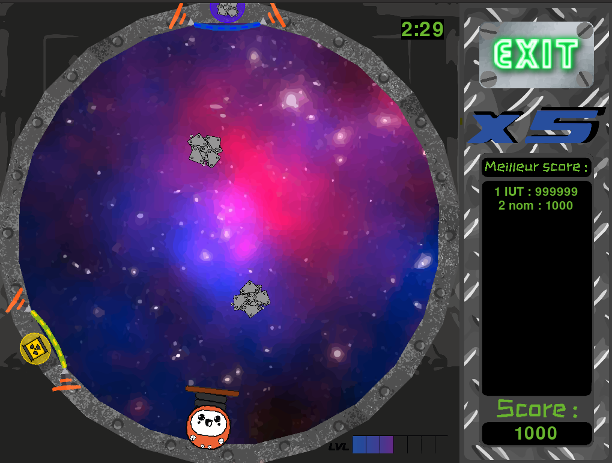

# TrashSpace

Game developed in team of 4 during the GameJam 2019 of the IUT2 (Grenoble, FR).  
Game developed in 96h with 4 constraints:
1. 3 minutes game (no more, no less)
2. Include gravity
3. Include a spring
4. Use Python and PyGame only

# Try it

Pre-requisite: Python > 3.8

## Venv configuration

```bash
python3 -m  venv env
source env/bin/activate
pip3 install -r requirements.txt
```

## Launch it

```bash
python3 main.py
```


----

